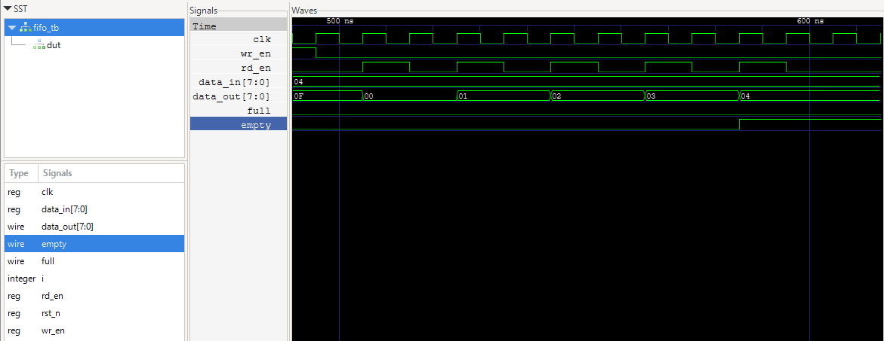

# FIFO Buffer (Verilog)

A parameterizable synchronous FIFO (First-In-First-Out) buffer implemented in Verilog, verified with a self-checking testbench in Icarus Verilog and GTKWave.

## Overview

This FIFO decouples the timing of a data producer and a data consumer — writes and reads can happen at independent rates, as long as the consumer doesn't fall more than `DEPTH` writes behind. Common use cases include clock-domain crossing buffers, UART Tx/Rx buffering, and bus interface decoupling.

## Design

- Parameterized `DATA_WIDTH` and `DEPTH` (defaults: 8-bit data, 16 entries)
- Full/empty detection via the extra-MSB pointer trick — read and write pointers are `$clog2(DEPTH)+1` bits wide, using the extra bit to disambiguate a full buffer from an empty one without a separate counter
- Synchronous, registered read output
- Asynchronous active-low reset

## Verification

Verified with a self-checking testbench (`fifo_tb.v`) covering:
- Basic write → read data integrity
- Fill-to-full behavior and overflow guard (write blocked when full)
- Read-from-empty behavior and underflow guard (read blocked when empty)
- Order preservation across multiple writes/reads

All tests pass via `$display`-based assertions, cross-checked against waveforms in GTKWave.



## Running the simulation

```bash
iverilog -o fifo_tb_sim fifo.v fifo_tb.v
vvp fifo_tb_sim
gtkwave fifo_tb.vcd
```

## Files

- `fifo.v` — FIFO module
- `fifo_tb.v` — self-checking testbench